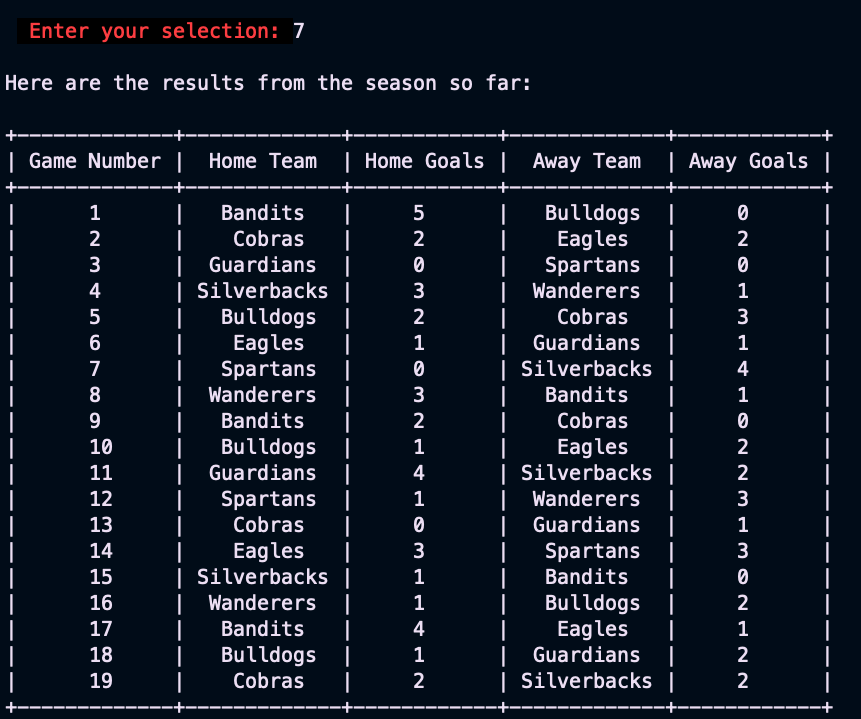

## Welcome to the Lake Macquarie Premier League App

## Index
1. [Github repository](https://github.com/reecewdoyle/T1A3)
2. [Presentation](pass)
3. [Introduction](#introduction)
4. [Installation](#installation)
5. [Features](#features)
6. [Resources](#resources)


## Introduction

The Lake Macquarie Premier League App is designed to be used by an administrator of an amateur Football (Soccer) competition in Lake Macquarie, NSW, Australia. 

It is designed to efficiently handle data for a 14 Round season among 8 local teams. Each team plays the 7 other teams in the competition twice per year, once at their home ground, and once as the away team at their opponents home ground, for a total of 56 games, played from November 2023 to March 2024.

The goal was to make the data for the entire season easy to store, and retrieve at a moments notice, based on a few predicted user stories:
* The administrator who wants to be able to store results in a simple CSV that could then be used to feed an Excel Spreadsheet.
* The fan, who wants to how many teams are in the competition and who they are. They will also be able to look up the games occurring in the coming week, or many weeks into the future. The may also want to check games that have already happened.
* The player, who wants to be able to plan their life around the games and wants to access easily where they'll be playing for the whole season in advance, and also look back at where they played.
* Any of the above users who want to be able to view a running tally of results of the games throughout the season. 


To meet all of these user stories, I decided that their would need to be 8 features in total:
1. Teams Competing 
2. Games this week
3. Display Rounds
4. Display the Draw for a particular team
5. Enter Results of a game
6. Delete Results of a game
7. View the current results in a table

[Back to index](#index)
***

## Installation

This app comes with a bash scripts that will automatically:
* Check for the right version of ```python```
* Install ```python```
* Lanuch a ```venv``` (virtual environment)

and then insall all the required packages to run this program, which are as follows:

```python
colored==2.2.4
DateTime==5.4
prettytable==3.9.0
pyfiglet==1.0.2
pytz==2023.3.post1
wcwidth==0.2.12
zope.interface==6.1
```

Once the user has opened `terminal` and naviagted to the `root directory` of the app, they simply need to type this into the command line and the app will launch:

```python
./start_here.sh
```
This is a very simple app, and to the best of my knowledge will work on either Windows, Linux, or MacOs. It should run easily on most modern machines.  
[Back to index](#index)
***

## Features
This is a detailed list of features with the corresponding code.

4.1 [Homescreen](#homescreen)

4.2 [Print Teams](#print-teams)

4.2 [Games this week](#games-this-week)

4.3 [Print a Round](#print-a-round)

4.4 [Print Draw for a Team](#print-draw-for-a-team)

4.5 [Enter Results](#enter-results)

4.6 [Remove Results](#remove-results)

4.7 [View Results](#view-results)

4.8 [Exit Screen](#exit-screen)

 [Back to index](#index)
 ***

## Homescreen

This is the homescreen that the user is greeted with when they execute the app. Selections for each of the features are entered with a simple keypad.

The code for the homescreen looks like this:


```python
from colored import fore, back, attr
from lmpl_functions import (
    print_teams, print_this_round, print_round, team_draw,
    enter_results, edit_results, view_results
)
import pyfiglet as pfg
import csv

# App Logo
text = pfg.print_figlet(text = "Lake Macquarie Premier League", font = "standard", colors = "red")

# App Greeting
print(f"{fore('red')}{back('white')} Welcome to the Lake Macquarie Premier League App for 23/24!{attr('reset')}\n")

file_name = "results.csv"

try:
    # open the file in read mode
    results = open(file_name, "r")
    results.close()
    # print("In try block")
    # if it throws an error, the file doesn't exist
    # if no error, the files exists
except FileNotFoundError:
    # Now, we know the file doesn't exist
    # Create a new file
    results = open(file_name, "w")
    results.write("Game Number,Home Team,Home Goals,Away Team,Away Goals\n")
    results.close()
    # print("In except block")

def create_menu():
    print(f"{fore('blue')} Enter 1 to view THIS YEAR'S TEAMS. {attr('reset')}")
    print(f"{fore('blue')} Enter 2 to view THIS WEEK'S GAMES. {attr('reset')}")
    print(f"{fore('blue')} Enter 3 to view a ROUND. {attr('reset')}")
    print(f"{fore('blue')} Enter 4 to view a TEAM'S DRAW. {attr('reset')}")
    print(f"{fore('blue')} Enter 5 to ENTER the RESULTS from a game.  {attr('reset')}")
    print(f"{fore('blue')} Enter 6 to REMOVE the RESULTS from a game.  {attr('reset')}")
    print(f"{fore('blue')} Enter 7 to VIEW the RESULTS.  {attr('reset')}")
    print(f"{fore('blue')} Enter 8 to exit.\n")
    choice = input(f"{fore('red')} {back('16')} Enter your selection: {attr('reset')}" "")
    return choice

users_choice = ""

while users_choice != "8":
    users_choice = create_menu()
    if (users_choice == "1"):
        print_teams()
    elif (users_choice == "2"):
        print_this_round()
    elif (users_choice == "3"):
        print_round()
    elif (users_choice == "4"):
        team_draw()
    elif (users_choice == "5"):
        enter_results(file_name)
    elif (users_choice == "6"):
        edit_results()
    elif (users_choice == "7"):
        view_results()
    elif (users_choice == "8"):
        continue
    else:
        print("Invalid Input")
```

To create the Logo, I used a package called `pyfiglet`. That allows the developer to make simple ASCII art. I added the logo at the start I chose red for the text and just one of the standard fonts. The relelvant code for this feature specifically is:
```python
import pyfiglet as pfg
# App Logo
text = pfg.print_figlet(text = "Lake Macquarie Premier League", font = "standard", colors = "red")
```
To get the text blue, I also used a package called `colored`.

`fore` is for foreground colour (text colour)

`back` is the background colour, which I used for the greeting. 

NB: This is displaying as green on in this picture because of how I have ohmyzsh set up on my machine. This would usually be white. 

`attr` allows you to stop using the colour attributes at this point.
The specific code of this is this:

```python
from colored import fore, back, attr

print(f"{fore('red')}{back('white')} Welcome to the Lake Macquarie Premier League App for 23/24!{attr('reset')}\n")

print(f"{fore('blue')} Enter 1 to view THIS YEAR'S TEAMS. {attr('reset')}")
```

The first thing the LMPL app does is create a csv file called `results.csv`

The file name is declared with `file_name = 'results.csv`.

The `try:` and `except:` blocks check to see if a file already exists. If the file doesn't exist it creates the file. 
The specific code for this is:
```python
file_name = "results.csv"

try:
    # open the file in read mode
    results = open(file_name, "r")
    results.close()
    # print("In try block")
    # if it throws an error, the file doesn't exist
    # if no error, the files exists
except FileNotFoundError:
    # Now, we know the file doesn't exist
    # Create a new file
    results = open(file_name, "w")
    results.write("Game Number,Home Team,Home Goals,Away Team,Away Goals\n")
    results.close()
    # print("In except block")
```
I needed to make sure that the `results.csv` is created with the correct fields for the data to store, so the headers it creates are `Game Number,Home Team,Home Goals,Away Team,Away Goals`

```python
results.write("Game Number,Home Team,Home Goals,Away Team,Away Goals\n")
```
The while loop that comes next allows the user to select which feature they'd like to use. It's a simple keypad operation. The user's choice is declared as a string with `user_choice`. 
```python
users_choice = ""

while users_choice != "8":
    users_choice = create_menu()
    if (users_choice == "1"):
        print_teams()
    elif (users_choice == "2"):
        print_this_round()
    elif (users_choice == "3"):
        print_round()
    elif (users_choice == "4"):
        team_draw()
    elif (users_choice == "5"):
        enter_results(file_name)
    elif (users_choice == "6"):
        edit_results()
    elif (users_choice == "7"):
        view_results()
    elif (users_choice == "8"):
        continue
```
Entering any number between 1 and 8 will call a fucntion.

If you enter anything other than a number from 1 to 8, you will be pushed into the else block, which prints "Invalid Input".

```python
    else:
        print("Invalid Input")
```

[Back to Features](#features)
***

## Print Teams


This is a simple function that prints the teams competing in the competition for the year. 

NB: Once agin, the text colour is green because of my settings on ohmyzsh.

The code for this fucntion is as follows:

```python
from colored import fore, back, attr

teams = [
    f"{fore('white')}{back('red')}Belmont Bandits{attr('reset')}", 
    f"{fore('white')}{back('blue')}Boolaroo Bulldogs{attr('reset')}", 
    f"{fore('white')}{back('yellow')}Charlestown Cobras{attr('reset')}", 
    f"{fore('white')}{back('131')}Eleebana Eagles{attr('reset')}", 
    f"{fore('white')}{back('56')}Glendale Guardians{attr('reset')}", 
    f"{fore('white')}{back('172')}Speers Point Spartans{attr('reset')}", 
    f"{fore('white')}{back('22')}Swansea Silverbacks{attr('reset')}", 
    f"{fore('white')}{back('13')}Warners Bay Wanderers{attr('reset')}"
]
```

This code is at the top of my functions page, as I use this ```teams``` list for multiple functions.

It necessary later in the design to include a version of this list that is just the team Macots. That list looks like this:

```python
team_mascots = [
    f"{fore('white')}{back('red')}Bandits{attr('reset')}", 
    f"{fore('white')}{back('blue')}Bulldogs{attr('reset')}", 
    f"{fore('white')}{back('yellow')}Cobras{attr('reset')}", 
    f"{fore('white')}{back('131')}Eagles{attr('reset')}", 
    f"{fore('white')}{back('56')}Guardians{attr('reset')}", 
    f"{fore('white')}{back('172')}Spartans{attr('reset')}", 
    f"{fore('white')}{back('22')}Silverbacks{attr('reset')}", 
    f"{fore('white')}{back('13')}Wanderers{attr('reset')}"
]
```

The code for this function is as follows:

```python
def print_teams():
    print("\nCongratulations to the following teams who've won selection "
      "in the Lake Macquarie Premier League for the 23/24 season: \n")
    print(*teams, sep="\n")
    print("\n")
```
`print(*teams, sep="\n")` means that the teans print without quotation marks and are seperated vertically.

[Back to Features](#features)
***
## Games this week


This function dispays the week of the year, and prints the games that are occuring this week. 

The code for this function is as follows:
```python
import csv
import datetime

def print_this_round():
    from datetime import date
    # Show actual date
    my_date = datetime.date.today()
    today = date.today()
    print(today.strftime(f"\nToday's date is %A %d %B %Y"))
    # Using isocalendar() function
    year, week_num, day_of_week = my_date.isocalendar()
    print(f"\nIt is week #" + str(week_num) + " for the year\n")
    print("This week's games are: ")
    
    found_games = False  # Variable to track if any games are found
    
    with open("lmpl.csv", "r") as f:
        reader = csv.reader(f)
        for row in reader:
            if row[0] == str(week_num):
                print("\n" "Round " + row[1] + "," +
                    " " + "Game" + " " + row[2] + "," +
                    " " + row[3] + " " + "vs" + " " +
                    row[4] + " " + row[5] + "," +
                    " " + row[6] + "," + " " + row[7])
                print("\n")
                found_games = True  # Set to True if at least one game is found

    if not found_games and week_num in range(6, 43):
        print("No Games this week.")
```
This function uses the `datetime` and `csv` packages.

It prints todays date in the format I specify with this code:

```python
 today = date.today()
    print(today.strftime(f"\nToday's date is %A %d %B %Y"))
```
```
%A = Day of the week
%d = is Day of the month
%B = is Month of the year
%Y = is the year
```

The week number is declared as the variable `week_num`. 

It's called with the `my_date.isocalandar()` argument.

The `week_num` argument is printed as a string with `str(week_num)` which is then used to search in the `lmpl.csv`, which contains all the data for the season, speciically, the Week of the year, Round, Game Number, Home Team, Away Team, Day of the Week, Date, and Time of the games. 

```python
Week,Round,Game Number,Home Team,Away Team,Day,Date,Time
44,1,1,Belmont Bandits,Boolaroo Bulldogs,Friday,3/11/23,18:00
44,1,2,Charlestown Cobras,Eleebana Eagles,Saturday,4/11/23,12:00
44,1,3,Glendale Guardians,Speers Point Spartans,Saturday,4/11/23,15:00
44,1,4,Swansea Silverbacks,Warners Bay Wanderers,Sunday,5/11/23,14:00
45,2,5,Boolaroo Bulldogs,Charlestown Cobras,Friday,10/11/23,18:00
45,2,6,Eleebana Eagles,Glendale Guardians,Saturday,11/11/23,12:00
45,2,7,Speers Point Spartans,Swansea Silverbacks,Saturday,11/11/23,15:00
45,2,8,Warners Bay Wanderers,Belmont Bandits,Sunday,12/11/23,14:00
46,3,9,Belmont Bandits,Charlestown Cobras,Friday,17/11/23,18:00
46,3,10,Boolaroo Bulldogs,Eleebana Eagles,Saturday,18/11/23,12:00
46,3,11,Glendale Guardians,Swansea Silverbacks,Sunday,19/11/23,14:00
46,3,12,Speers Point Spartans,Warners Bay Wanderers,Friday,24/11/23,18:00
47,4,13,Charlestown Cobras,Glendale Guardians,Friday,1/12/23,18:00
47,4,14,Eleebana Eagles,Speers Point Spartans,Saturday,2/12/23,12:00
47,4,15,Swansea Silverbacks,Belmont Bandits,Sunday,3/12/23,14:00
47,4,16,Warners Bay Wanderers,Boolaroo Bulldogs,Friday,8/12/23,18:00
48,5,17,Belmont Bandits,Eleebana Eagles,Friday,15/12/23,18:00
48,5,18,Boolaroo Bulldogs,Glendale Guardians,Saturday,16/12/23,12:00
48,5,19,Charlestown Cobras,Swansea Silverbacks,Sunday,17/12/23,14:00
48,5,20,Warners Bay Wanderers,Speers Point Spartans,Friday,22/12/23,18:00
49,6,21,Belmont Bandits,Glendale Guardians,Friday,29/12/23,18:00
49,6,22,Boolaroo Bulldogs,Speers Point Spartans,Saturday,30/12/23,12:00
49,6,23,Charlestown Cobras,Warners Bay Wanderers,Sunday,31/12/23,14:00
49,6,24,Eleebana Eagles,Swansea Silverbacks,Friday,5/1/24,18:00
50,7,25,Belmont Bandits,Swansea Silverbacks,Friday,12/1/24,18:00
50,7,26,Charlestown Cobras,Warners Bay Wanderers,Saturday,13/1/24,12:00
50,7,27,Eleebana Eagles,Boolaroo Bulldogs,Saturday,13/1/24,15:00
50,7,28,Glendale Guardians,Speers Point Spartans,Sunday,14/1/24,14:00
51,8,29,Belmont Bandits,Speers Point Spartans,Friday,19/1/24,18:00
51,8,30,Boolaroo Bulldogs,Swansea Silverbacks,Saturday,20/1/24,12:00
51,8,31,Eleebana Eagles,Warners Bay Wanderers,Saturday,20/1/24,15:00
51,8,32,Glendale Guardians,Charlestown Cobras,Sunday,21/1/24,14:00
52,9,33,Belmont Bandits,Warners Bay Wanderers,Friday,26/1/24,18:00
52,9,34,Boolaroo Bulldogs,Charlestown Cobras,Saturday,27/1/24,12:00
52,9,35,Glendale Guardians,Eleebana Eagles,Saturday,27/1/24,15:00
52,9,36,Speers Point Spartans,Swansea Silverbacks,Sunday,28/1/24,14:00
1,10,37,Belmont Bandits,Boolaroo Bulldogs,Friday,2/2/24,18:00
1,10,38,Charlestown Cobras,Eleebana Eagles,Saturday,3/2/24,12:00
1,10,39,Glendale Guardians,Speers Point Spartans,Saturday,3/2/24,15:00
1,10,40,Swansea Silverbacks,Warners Bay Wanderers,Sunday,4/2/24,14:00
2,11,41,Boolaroo Bulldogs,Charlestown Cobras,Friday,9/2/24,18:00
2,11,42,Eleebana Eagles,Glendale Guardians,Saturday,10/2/24,12:00
2,11,43,Speers Point Spartans,Swansea Silverbacks,Saturday,10/2/24,15:00
2,11,44,Warners Bay Wanderers,Belmont Bandits,Sunday,11/2/24,14:00
3,12,45,Belmont Bandits,Charlestown Cobras,Friday,16/2/24,18:00
3,12,46,Boolaroo Bulldogs,Eleebana Eagles,Saturday,17/2/24,12:00
3,12,47,Glendale Guardians,Swansea Silverbacks,Saturday,17/2/24,15:00
3,12,48,Speers Point Spartans,Warners Bay Wanderers,Sunday,18/2/24,14:00
4,13,49,Charlestown Cobras,Glendale Guardians,Friday,23/2/24,18:00
4,13,50,Eleebana Eagles,Speers Point Spartans,Saturday,24/2/24,12:00
4,13,51,Swansea Silverbacks,Belmont Bandits,Saturday,24/2/24,15:00
4,13,52,Warners Bay Wanderers,Boolaroo Bulldogs,Sunday,25/2/24,14:00
5,14,53,Belmont Bandits,Eleebana Eagles,Friday,2/3/24,18:00
5,14,54,Boolaroo Bulldogs,Glendale Guardians,Saturday,3/3/24,12:00
5,14,55,Charlestown Cobras,Swansea Silverbacks,Saturday,3/3/24,15:00
5,14,56,Warners Bay Wanderers,Speers Point Spartans,Sunday,4/3/24,14:00
```
If the CSV reader finds a week number that matches the week of the year, it prints the games for this week.If the app is used outside of the weeks of the year with games (any number between 6 and 43), it goes in't the `if not` statement and prints `No Games this week`

I created a test for this function, as it is obviously difficult to prove it works anytime of the year. I did this by simply commenting out the datetime elements of the function and declaring `week_num = week_num_to_test`

```python
import csv
# import datetime

def print_this_round():
    # from datetime import date
    # # Show actual date
    # my_date = datetime.date.today()
    # print(my_date)
    # # Using isocalendar() function
    # year, week_num, day_of_week = my_date.isocalendar()
    # print("Week #" + str(week_num))
    # print("This week's games are: ")
    
    week_num = week_num_to_test

    found_games = False  # Variable to track if any games are found
    
    with open("lmpl.csv", "r") as f:
        reader = csv.reader(f)
        for row in reader:
            if row[0] == str(week_num):
                print("\n" "Round " + row[1] + "," +
                    " " + "Game" + " " + row[2] + "," +
                    " " + row[3] + " " + "vs" + " " +
                    row[4] + " " + row[5] + "," +
                    " " + row[6] + "," + " " + row[7])
                print("\n")
                found_games = True  # Set to True if at least one game is found

    if not found_games and week_num in range(6, 43):
        print("No Games this week.")

# Test the function with a specific week_num value
week_num_to_test = 10  # Change this to the desired week number
print_this_round()
```

[Back to Features](#features)
***

## Print a Round


This function allows the user to simply select a number between 1 and 14 to print the games happening in that particular round. 

As it is once again using csv to read the lmpl.csv file, I had to declare rounds as a list of strings. In the while loop, the round_number is also converted from an int to a str, so it can search the csv. However, the input is made into an int, so it can handle error exceptions. The user cannont enter anything but the numbers 1 -14, or the app will print:

`Invalid input! Must be a number between 1 and 14`

```python
def print_round():
    print("\nThere are 14 rounds in the LMPL Competition for this year.\n")
    print("Each team plays each other twice, once at Home, and once Away.\n")
    round_number = 0
    rounds = [
        "1", "2", "3", "4", "5", "6", "7", "8", "9", "10", "11", "12", "13", "14"
    ]


    while str(round_number) not in rounds:
        try:
            round_number = int(input("Enter the round (1-14) you'd like to print: "))
            if str(round_number) in rounds:
                with open("lmpl.csv", "r") as f:
                    reader = csv.reader(f)
                    round_selected = rounds[round_number - 1]
                    print(f"\nThese are the games in Round {round_selected}\n")
                    for row in reader:
                        try:
                            if row[1] == round_selected:
                                print(f"Round {row[1]}, Game {row[2]}, {row[3]} vs {row[4]}, "
                                      f"{row[5]}, {row[6]}, {row[7]}")

                                print("\n")
                        except IndexError:
                            print("Invalid")
                            break
        except ValueError:
            print("Invalid input! Must be a number between 1 and 14")
```

[Back to Features](#features)
 ***

## Print Draw for a Team


This function allows the user to select the team they play for, and print only their teams draw for the year. 

```python
def team_draw():
    print("\nPlease enter the number that corresponds to the team you want to see the draw for.\n")
    for _index, team  in enumerate(teams):
        print(f"{_index + 1}. {team}")

    team_selection = 0
    teams_menu = ["Belmont Bandits", 
                  "Boolaroo Bulldogs", 
                  "Charlestown Cobras", 
                  "Eleebana Eagles", 
                  "Glendale Guardians", 
                  "Speers Point Spartans", 
                  "Swansea Silverbacks", 
                  "Warners Bay Wanderers"]
    while team_selection not in teams_menu:
        try:
            with open("lmpl.csv", "r") as f:
                reader = csv.reader(f)
                team_selection = int(input("\nTeam Number: "))
                if(team_selection not in range(1,9)):
                    raise ValueError
                team_draw = teams_menu[((team_selection) - 1)]
                print("\nThis is the" + " " + team_draw + " " + "draw for this season.\n")
                for row in reader:
                        if row[3] == team_draw or row[4] == team_draw:
                            print(f"Round {row[1]}, {row[3]} vs {row[4]}, {row[5]}, {row[6]}, {row[7]}\n")
               
                team_selection = teams_menu[((team_selection) - 1)]

        except ValueError:
            print("Must be a number between 1 and 8 which corresponds to the team.")
```

I used the `teams` list declared at the beginning and used by fucntion 1 to print out the names of the teams with the coloured backgrounds. This is a for loop that adds a number before each of the team names and stops when all teams have been printed out. 

```python
for _index, team  in enumerate(teams):
        print(f"{_index + 1}. {team}")
```
However, I once again need to specifically declare the teams names with the `teams_menu` list, as the csv reader is specifically looking for those team names as strings. 

```python
   team_selection = 0
    teams_menu = ["Belmont Bandits", 
                  "Boolaroo Bulldogs", 
                  "Charlestown Cobras", 
                  "Eleebana Eagles", 
                  "Glendale Guardians", 
                  "Speers Point Spartans", 
                  "Swansea Silverbacks", 
                  "Warners Bay Wanderers"]
```
The user enters an int that corresponds to their team. 

```python
    while team_selection not in teams_menu:
        try:
            with open("lmpl.csv", "r") as f:
                reader = csv.reader(f)
                team_selection = int(input("\nTeam Number: "))
```
The try and except only allow for ints, or this error is thrown.

```python
        except ValueError:
            print("Must be a number between 1 and 8 which corresponds to the team.")
```
This `ValueError` is also raised if the user enters any number outside of 1-8.

```python
if(team_selection not in range(1,9)):
                    raise ValueError
```
To account for the fact that python counts from zero, team_selection had to be declared as an integer, so we could `-1` and have `1 = Belmont Bandits` instead of `0 = Belmont Bandits`.

```python
team_draw = teams_menu[((team_selection) - 1)]
```
If either of name of the team selected is found in either `row[3]` or `row[4]` (the Home Team and Away Team fileds of the lmpl.csv), it prints out the games in this format:


```python
if row[3] == team_draw or row[4] == team_draw:
    print(f"Round {row[1]}, {row[3]} vs {row[4]}, {row[5]}, {row[6]}, {row[7]}\n")
```

`Round 1, Belmont Bandits vs Boolaroo Bulldogs, Friday, 3/11/23, 18:00`

[Back to Features](#features)
***

## Enter Results


This is the function that allows us to enter the results in the `results.csv` file created in the menu screen. 

The first thing we see is a table (which will be explained in Function 7). 

NB: For the purposes of demonstration, this particular csv is already populated. When the user opens this app for the first time, the `results.csv` file will be empty. 

This is a long one!

```python
import re

def enter_results(file_name):
    view_results()

    print("\nLet's enter the results of a game!")
    print("\nFirst, we need the Unique Game Number. It will be a number from 1 to 56 and can only be used once.")
    print("\nNOTE: Don't enter a game number that has already been used in the table above.\n")
    with open(file_name, "a") as f:
        game_number = int
        while game_number != 0:
            try:
                game_number = int(input("Enter the Game Number. (enter 0 to return to the main menu): "))
                if game_number not in range(1, 57):
                    print("Must be a number between 1 and 56")
                else:
                    break
            except ValueError:
                print("Must be a number between 1 and 56")

        if game_number != 0:
            print("\nNow we need to enter the MASCOT of the HOME TEAM")
            print("Type the name of the MASCOT out, just as you see it below.")
            print("NO SPACES, NUMBERS, or SPECIAL CHARACTERS\n")
            print_team_mascots()
            home_team_name = True
            while home_team_name:
                home_team = input("\nEnter the Home Team: ")
                invalid_name = re.search("[^A-Za-z]+", home_team)

                if invalid_name:
                    print("No special characters will be accepted.")
                elif not home_team:
                    print("You must type something in!")
                else:
                    print("\nAccepted.\n")
                    home_team = home_team.lower()
                    home_team = home_team.title()
                    n = False
                    break

            home_goals = 0
            while True:
                try:
                    home_goals = int(input("Enter the Home Goals: "))
                    break
                except ValueError:
                    print("Invalid input. Please enter an integer.")

        if game_number != 0:
            away_team_name = True
            print("\nGreat! Now onto the AWAY TEAM\n")
            print("Enter the MASCOT of the AWAY TEAM")
            print("Type the name of the MASCOT out, just as you see it below.")
            print("NO SPACES, NUMBERS, or SPECIAL CHARACTERS\n")
            print_team_mascots()
            while away_team_name:
                away_team = input("\nEnter the Away Team: ")
                invalid_name = re.search("[^A-Za-z]+", away_team)

                if invalid_name:
                    print("No special characters will be accepted.")
                elif not away_team:
                    print("You must type something in!")
                else:
                    print("\nAccepted.\n")
                    away_team = away_team.lower()
                    away_team = away_team.title()
                    n = False
                    break

            away_goals = 0
            while True:
                try:
                    away_goals = int(input("Enter the Away Goals: "))
                    break
                except ValueError:
                    print("Invalid input. Please enter an integer.")

            writer = csv.writer(f)
            writer.writerow([game_number, home_team, home_goals, away_team, away_goals])
            print("\nThank you! You can check your entry with option 7 on the main menu.\n")

def print_team_mascots():
    for mascot in team_mascots:
        print(mascot)
```
I told ya it was long! So I've chunked it down into parts.


```python
import re

def enter_results(file_name):
    view_results()

    print("\nLet's enter the results of a game!")
    print("\nFirst, we need the Unique Game Number. It will be a number from 1 to 56 and can only be used once.")
    print("\nNOTE: Don't enter a game number that has already been used in the table above.\n")
    with open(file_name, "a") as f:
        game_number = int
        while game_number != 0:
            try:
                game_number = int(input("Enter the Game Number. (enter 0 to return to the main menu): "))
                if game_number not in range(1, 57):
                    print("Must be a number between 1 and 56")
                else:
                    break
            except ValueError:
                print("Must be a number between 1 and 56")
```
For the first time, we're utilising `file_name`, which is out `results.csv`.

After printing the instructions, the `game_number` is declared as an int, so the `0` can be used as an escape key to take you back to the main menu. 

As there are only 56 games for the year, any int outside of the `range(1, 57)` will print `Must be a number between 1 and 56`.

As it's an int input, any other kind of input will throw an exception for `ValueError` and once again print `Must be a number between 1 and 56`.


This is all the code required to print the names of the mascots in the team colours. 

```python
team_mascots = [
    f"{fore('white')}{back('red')}Bandits{attr('reset')}", 
    f"{fore('white')}{back('blue')}Bulldogs{attr('reset')}", 
    f"{fore('white')}{back('yellow')}Cobras{attr('reset')}", 
    f"{fore('white')}{back('131')}Eagles{attr('reset')}", 
    f"{fore('white')}{back('56')}Guardians{attr('reset')}", 
    f"{fore('white')}{back('172')}Spartans{attr('reset')}", 
    f"{fore('white')}{back('22')}Silverbacks{attr('reset')}", 
    f"{fore('white')}{back('13')}Wanderers{attr('reset')}"
]

def print_team_mascots():
    for mascot in team_mascots:
        print(mascot)
```
This prints just the mascot names of the teams in the team colours. 
```python
        if game_number != 0:
            print("\nNow we need to enter the MASCOT of the HOME TEAM")
            print("Type the name of the MASCOT out, just as you see it below.")
            print("NO SPACES, NUMBERS, or SPECIAL CHARACTERS\n")
            print_team_mascots()
            home_team_name = True
            while home_team_name:
                home_team = input("\nEnter the Home Team: ")
                invalid_name = re.search("[^A-Za-z]+", home_team)

                if invalid_name:
                    print("No special characters will be accepted.")
                elif not home_team:
                    print("You must type something in!")
                else:
                    print("\nAccepted.\n")
                    home_team = home_team.lower()
                    home_team = home_team.title()
                    n = False
                    break
```

In testing, I discovered a major issue, where if you were to just hit `Enter`, you would create an empty row in the `resutls.csv`, which essentially crashed the whole app. 

To get around this I used `import re` package for the re.search, which allows you to exclude special characters from the input. 

This is why I chose to make the input as just the mascot names. 

Entering 'Belmont Bandits' requires a space, is a `special character` and falls into the `invalid_name` declaration and prints `No special character will be accpeted`. This solved the no input issue. 

```python
            home_goals = 0
            while True:
                try:
                    home_goals = int(input("Enter the Home Goals: "))
                    break
                except ValueError:
                    print("Invalid input. Please enter an integer.")
```

The goals simply needed to be an integer and nothing else. Technically, you could put a very large integer in there if you wanted. I was going to make it so that you could only put in a number between 0 and 5, but you never know! A team could score more than 5 goals in a game, but it is rare. Anything other than an integer throws the `ValueError`.


We then essentially repeat the process for the Away team. The code is the same, with the only difference being the word `home` is replaced with `away` wherever applicable. 

```python
            writer = csv.writer(f)
            writer.writerow([game_number, home_team, home_goals, away_team, away_goals])
            print("\nThank you! You can check your entry with option 7 on the main menu.\n")
```

The last piece of code writes each of the inputs stored in variables in the `results.csv` file.

[Back to Features](#features)
***

## Remove Results


Obviously, people make mistakes. If you enter the data wrong, you should be able to delete it. 

Another longish one!

```python
def edit_results():
    game_results = ""
    removed_result = ""

    while game_results != "0":
        view_results()
        print("\n")

        try:
            games_list = []

            game_results = input("Enter the GAME NUMBER for the RESULTS you want to REMOVE "
                     "(enter 0 to return to the main menu): ")

            if not game_results.isdigit():
                raise ValueError
        except ValueError:
            print("Must be a number")

        try:
            current_game_numbers = []    
            with open(file_name, "r") as f:
                reader = csv.reader(f)
                for row in reader:
                    current_game_numbers.append(row[0])
                    if game_results != row[0]:
                        games_list.append(row)
                    else:
                        removed_result = row[0]

            with open(file_name, "w") as f:
                writer = csv.writer(f)
                writer.writerows(games_list)

            if game_results not in current_game_numbers and game_results != "0":
                raise UnboundLocalError

        except UnboundLocalError:
            print("Must be a number that corresponds with the Game Number "
                  "for the Game you want to delete.")
```

Okay, maybe not that long...anyway.

Once again, we print the table (which I will explain after this...but it's pretty straightforward...)

This function reuses the `0` as an escape key feature. 

`games_results` and `removed_results` are declared as a strings. Working in strings for the csv. 

The user enters the game number. Anything other than a number will throw the `ValueError`.

This function adds everything other than the `Game Number` the user entered to the `current_game_numbers` list. 

The writer then rewrites a new `results.csv` file over the top of the existing file with the only the selected values. This is in a loop so results can be deleted quickly. 

A game number other than a number in the `results.csv` will throw the `UnboundLocalError`.

[Back to Features](#features)
 ***

## View Results



Finally! Talking about the table I've used in the last two functions!

```python
from prettytable import from_csv

def view_results():
    print("\nHere are the results from the season so far: \n")
    with open("results.csv") as f:
        table = from_csv(f)
    print(table)   
```
This one is very simple.

`prettytable` uses `from_csv` to create a table from the `results.csv` and it prints it out. 

Simple, but effective!

 [Back to Features](#features)
 ***

## Exit Screen


This is a consequence of the user selection being 8 on the menu screen:

```python
users_choice = ""

while users_choice != "8":
    users_choice = create_menu()
    if (users_choice == "1"):
        print_teams()
    elif (users_choice == "2"):
        print_this_round()
    elif (users_choice == "3"):
        print_round()
    elif (users_choice == "4"):
        team_draw()
    elif (users_choice == "5"):
        enter_results(file_name)
    elif (users_choice == "6"):
        edit_results()
    elif (users_choice == "7"):
        view_results()
    elif (users_choice == "8"):
        continue
    else:
        print("Invalid Input")
```

I simply added a small print that happens when the user exits the app. It uses `pyfiglet` and `colored` again in the same way that has already been explained in other functions. 

```python
import pyfiglet as pfg 

# App Fareweall and Logo
print("\n")       
print(f"{fore('red')} {back('white')} Thank you for using the Lake Macquarie Premier League App! {attr('reset')}")
print("\n")       
text = pfg.print_figlet(text = "Thank You !\n\nL . M . P . L", font = "standard", colors = "red")

```

## Resources

Other than the Ed resources and Discord server that all Coder Academy students have access to, I also used these various sites and videos to help be build this app:

- [PEP8](https://peps.python.org/pep-0008/)
- [PyFi](https://pypi.org)
- [re](https://docs.python.org/3/library/re.html)
- [how I worked out how to implement re](https://stackoverflow.com/questions/36500911/validation-rule-user-input-cannot-be-left-blank-python)
- [pyfiglet](https://pypi.org/project/pyfiglet/#description) 
- [pyfiglet guide](https://www.javatpoint.com/python-pyfiglet-module)
- [colored](https://pypi.org/project/colored/)
- [colored guide](https://dslackw.gitlab.io/colored/)
- [datetime](https://docs.python.org/3/library/datetime.html)
    - [This clip on how to use datetime](https://www.youtube.com/watch?v=-AlFiS74aQg&t=148s)
    - [This clip for weeks](https://www.youtube.com/watch?v=XsDivI3Un7s&t=61s)

 [Back to Index](#index)
 ***